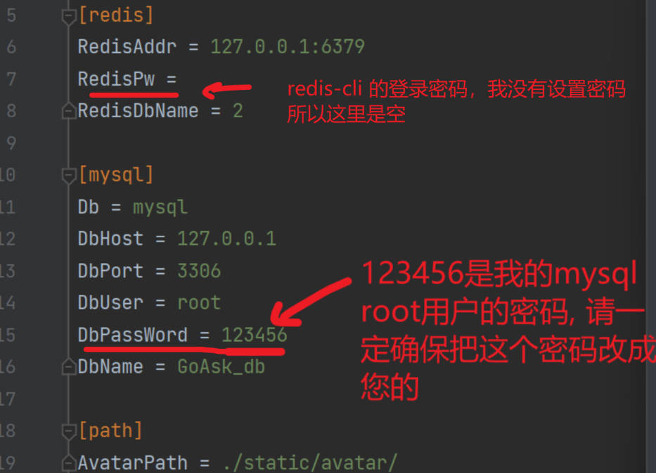
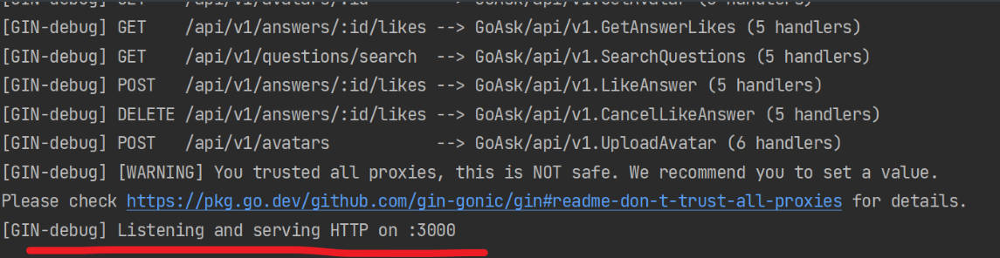
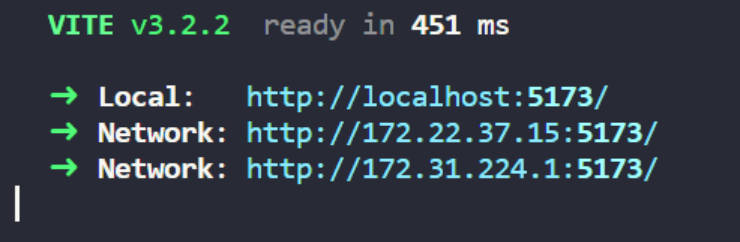
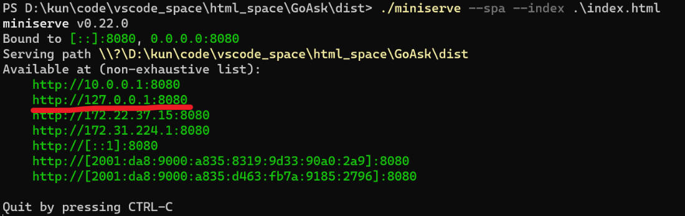

# GoAsk 问答平台

------

GoAsk 问答平台是一个开放、自由的问答平台，界面简洁清晰。后端采用Go语言编写，采用Gin和Gorm框架，前端采用 vue3、vite、TypeScript编写。

GoAsk 网站已经部署到了个人服务器上，可以在浏览器中直接访问：

http://43.143.216.157:8000  或  http://bolezhiping.top:8000

注：暂时没有申请SSL证书，密码虽然是密文存储，但是是明文传输，所以请注意隐私。


## 技术特点

**后端特点**

- 后端分层设计，含Controller、Service、DAO(cache)、Model层
- 主体为Gin框架，DAO层使用Gorm进行数据访问
- Redis作为cache处理点赞、统计浏览量业务
- 支持MySQL的主从复制配置（仅在开发环境单台机器上测试过）
- 登录采用JWT签发认证
- 支持日志、错误处理，便于维护

**前端特点**

- 前后端分离，前端用Axios异步请求数据
- 用vue router进行view之间的路由
- UI选用Element Plus组件

------


## 部署方式

由于采用前后端分离架构，所以前后端可以单独部署。

### 后端部署

**mysql 配置**

   在控制台用root用户连接上mysql服务，并输入密码:

```
mysql -u root -p
```

  登录后，创建所需要的数据库：

```
create database GoAsk_db default character set utf8mb4
```

**redis 配置**

  开启在 redis-server.exe 所在目录下运行 

```shell
./redis-server.exe
```

**后端程序配置**

   首先是修改 backend/config/config.ini 的配置文件，这里一般需要修改的就是 redis、mysql 的登录密码，比如 DbPassword 表示 mysql 数据库的密码，而 RedisPw 表示 redis-cli 的登录密码（我没有密码，所以为空）。其他配置看字段名应该能知道意思，一般也不需要改变。



**运行部署**

当一切配置好后，GoAsk文件夹下开启终端，运行main.exe文件：

```shell
./main.exe
```



  看到控制台输出该行，说明运行成功，后端配置完毕！

------


## 前端配置

正式部署时推荐使用Nginx等服务器，以下方式提供一些开箱即用的部署方式。

**方法1**：如果有python 环境，可以利用python的标准库在.\GoAsk 目录下运行运行：

```shell
python -m http.server 8080 --directory .\frontend\dist\
```

  然后进入 http://localhost:8080 即可。

**方法2**：如果有node环境，直接在 .\GoAsk\frontend 目录下运行以下指令：

```shell
npm run dev -- --host
```

运行结果如下，选择第一个进入即可：



**方法3**: 如果没有以上环境，直接在 .\frontend\dist 目录下运行

```shell
./miniserve --spa --index .\index.html
```

